<p align="center">
  <a href="https://ai4life.eurobioimaging.eu/open-calls/">
    
  </a>
</p>


# Project #6: Murine skeletal muscle analysis

---
This page was created by the [AI4Life project](https://ai4life.eurobioimaging.eu) using data provided by Emiliana Giacomello at [University of Trieste](http://www.units.it). 
All the images demonstrated in this tutorial are provided under **CC-BY** licence.

If any of the instructions are not working, please [open an issue](https://github.com/ai4life-opencalls/project_11/issues) or contact us at [ai4life@fht.org](ai4life@fht.org)! 

**Project challenges**: sample alignment, cell instance segmentation, cell linking.

## Table of Contents
1. [Introduction](#introduction)
2. [Installation](#installation)
3. [Pipeline overview](#pipeline-overview)
4. [Step #1: Data-specific preprocessing in Fiji](#step-1-data-specific-preprocessing-in-fiji)
5. [Step #2: Align the images with BigWarp](#step-2-align-the-images-with-bigwarp)
6. [Step #3: Link the cells with TrackMate](#step-3-link-the-cells-with-trackmate)
7. [How to train your own Cellpose model](#how-to-train-your-own-cellpose-model)
8. [Conclusion](#conclusion)

## Introduction
Researchers from the University of Trieste are studying the regulation of the metabolical properties in murine skeletal muscles. They want to analyze a series of sections of a single muscle stained with different markers and imaged with light microscopy. The goal of the analysis is to segment all cells in each section and identify them across different acquired images. Although the cells should be present in each section, their morphology can be vastly different, making identification across sections a challenging task.

In this tutorial, we will demonstrate how to align the different muscle slices to each other using [ImageJ BigWarp](https://imagej.net/plugins/bigwarp), then segment muscle cells with [Cellpose](https://www.cellpose.org/) and link them between multiple images using [ImageJ Trackmate](https://imagej.net/plugins/trackmate/).

Here is an exaple of two resulting images, where all the cells are segmented and the same cells are marked with the same color:
<div align="center"> 
  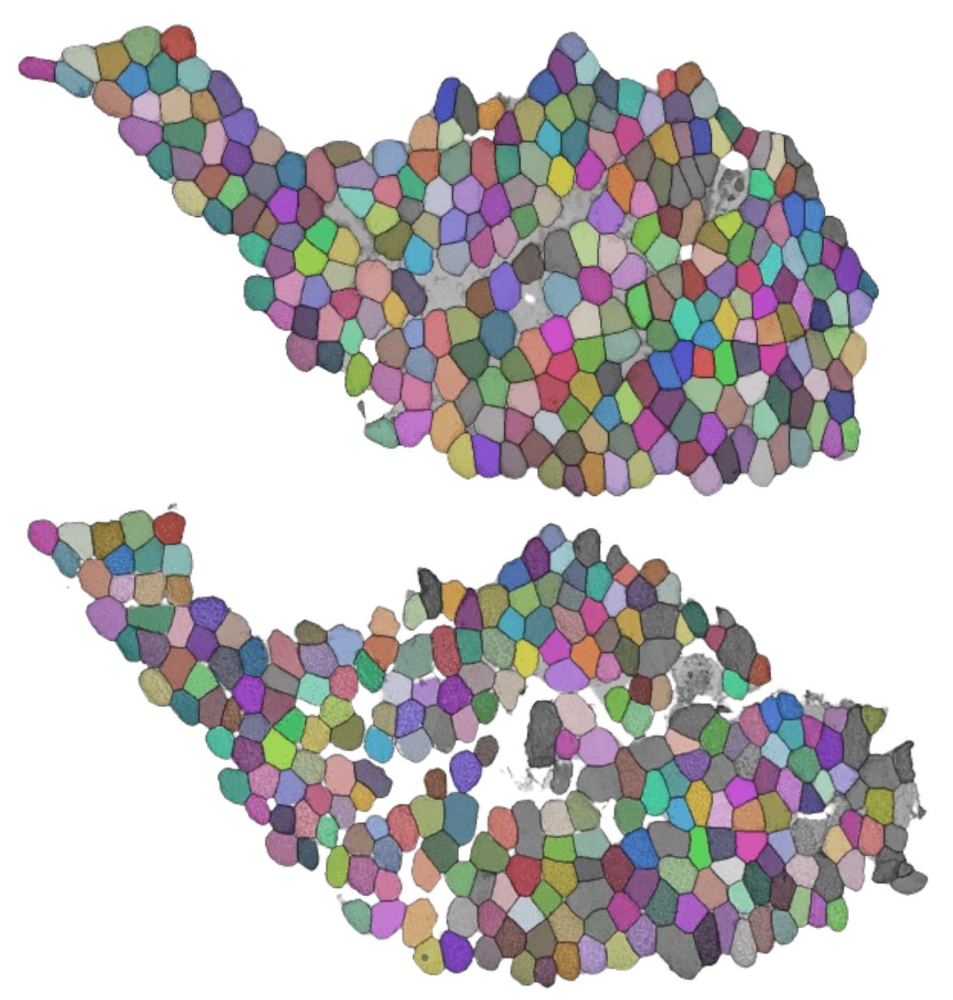
</div>

Let's get started! 

## Pipeline overview:

1) Data-specific preprocessing in Fiji

2) Aligning images with [ImageJ BigWarp](https://imagej.net/plugins/bigwarp)

3) Segmentation with [Cellpose](https://www.cellpose.org/) and cell linking with [ImageJ Trackmate](https://imagej.net/plugins/trackmate/).


## Installation

### Install Python package manager
We recommend installing [conda](https://conda.io/projects/conda/en/latest/user-guide/install/index.html) or [mamba](https://mamba.readthedocs.io/en/latest/). Go to the website and follow the installation instructions for your operating system.  
During installation, select the installation folder that you have permissions for, such as your home folder.

### Install Cellpose
Follow [Cellpose installation](https://github.com/MouseLand/cellpose) for official instructions.  
If you are using GPU check out [GPU version (CUDA) on Windows or Linux](https://github.com/MouseLand/cellpose?tab=readme-ov-file#gpu-version-cuda-on-windows-or-linux) section.

<details>
<summary>Cellpose installation details</summary>

1. Create a new python environment:
   ```bash
   conda create -n cellpose python=3.9
   conda activate cellpose
   ``` 
2. **If you have a GPU**, install PyTorch by following the [official instructions](https://pytorch.org/). Select a version that is compatible with your driver version. Follow [this link](https://pytorch.org/get-started/previous-versions/) for older versions.  
We will be installing PyTorch version 1.12 and cudatoolkit version 11.3 as an example:
   ```bash 
   conda install pytorch==1.12.0 torchvision==0.13.0 cudatoolkit=11.3 -c pytorch
   ``` 
3. **If you have a GPU**, check if the Pytorch installation is correct. If you are using GPU, this command should return a list of available devices:
   ```bash
   python -c "import torch; print([torch.cuda.get_device_properties(i) for i in range(torch.cuda.device_count())])"`
   ```
4. Install Cellpose:
   ```bash 
   pip install pyqt5 "cellpose[gui]"
   ```
5. Check the installation by running Cellpose. You should see the Cellpose window open:
   ```bash
   cellpose
   ```
</details>

### Install TrackMate-Cellpose

Follow  [TrackMate-Cellpose](https://imagej.net/plugins/trackmate/detectors/trackmate-cellpose) for official instructions.
<details>
<summary>TrackMate-Cellpose installation details</summary>

1. Open Fiji.
2. Add The **TrackMate-Cellpose** update site and restart Fiji.
3. In your **cellpose** conda environment, run this command to find where your python is installed:
   ```bash
   which python
   ```
4. Open TrackMate and select **Cellpose detector** from the list of available detectors.
5. Insert the path to your python in Path to Cellpose 
</details>


## Step #1: Data-specific preprocessing in Fiji

Download example images here: **TBD**

Crop the empty background:

1. If necessary, add scale information to the image in `Image > Properties... >`.  
   Set the pixel width and height to the estimated number of microns. For example: 
   <div> 
     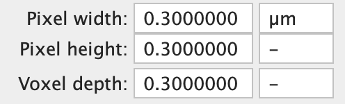
   </div>
   Now you should see the scale on top of the image:
   <div> 
     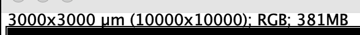
   </div>
2. Press `Edit › Selection › Select Bounding Box` to select the non-empty region 
3. Press `Image › Crop` to crop the region
4. You can scale the image to reduce its size for faster pipeline performance.   
   Press `Image > Scale...` and enter the desired scale, like 0.5 or 0.25. 

## Step #2: Align the images with BigWarp
[BigWarp](https://imagej.net/plugins/bigwarp) is an ImageJ plugin that helps to align and register images using interest points as a reference. This plugin comes with [Fiji](https://imagej.net/software/fiji/), so no installation should be required.


1. Open two cropped images, the `target image` one will be a reference, and the `moving image` will be the one scaled and rotated. 
2. Go to `Plugins > BigDataViewer > Big Warp`.
3. Select your two images:
   <div> 
     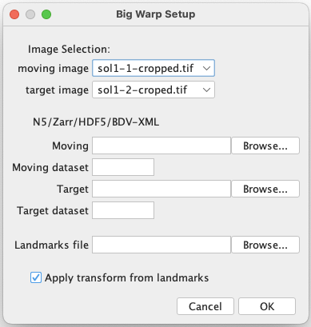
   </div>

4. Press *Space* to enter `Landmark mode`. 
5. Put reference points on both images alternately.  
   In case of an error - delete the error point in the `Landmarks` window.  
   You can press *Space* again to exit the `Landmark mode` to be able to zoom, move, and rotate the images.
6. Place points on several **same cells**. Try to cover all sides of the sample, like so: 
   <div> 
     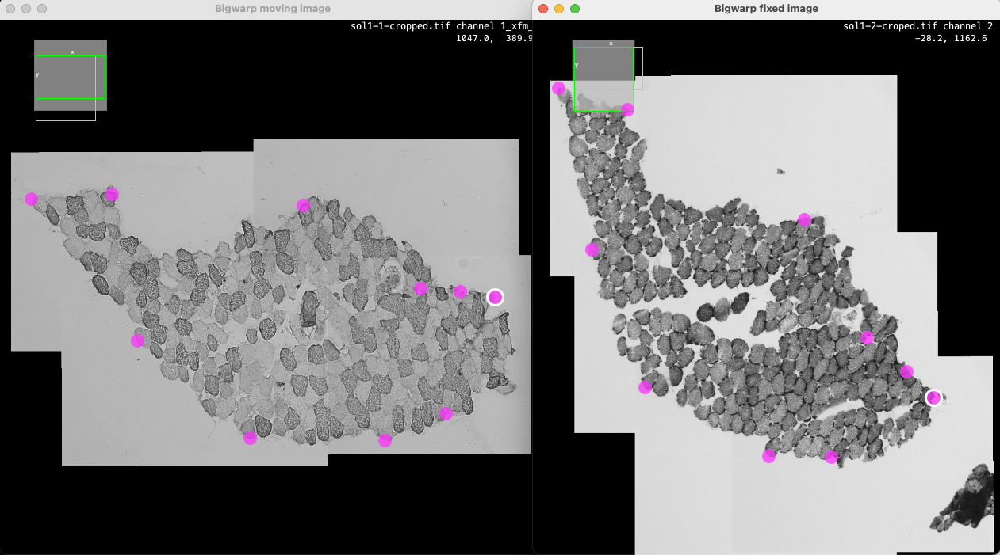
   </div>

7. We suggest using affine transform for aligning to avoid warping artifacts. Press `F2` to select the “Affine” transformation type from the menu. 
   <div> 
     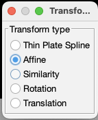
   </div>
8. Press `T` to see the result
   <div> 
     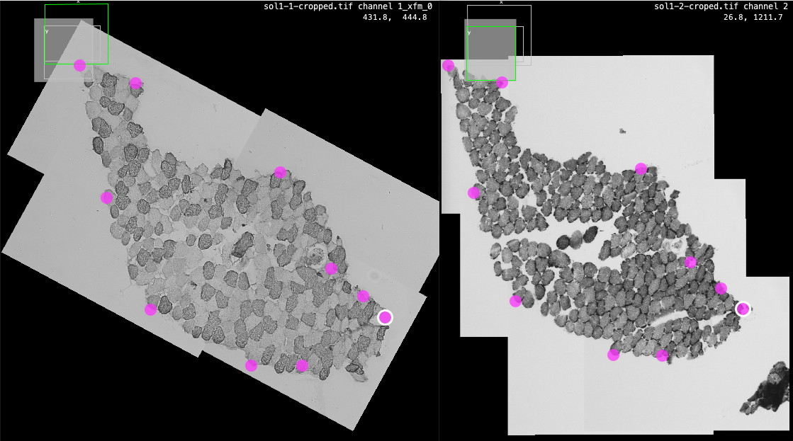
   </div>
    
9. Press `File > Export moving image > OK` to export the rotated image. 
 The new image will be opened in a new window.


## Step #3: Link the cells with TrackMate

To link cells between images we will be using a plugin designed for tracking - [Trackmate](https://imagej.net/plugins/trackmate/).

1. Download and unzip the pretrained segmentation model: [cellpose_model.zip](resources/trained_models/cellpose_model.zip)
2. Make a stack of images. Open all the images, `Image > Stacks > Images to Stack`.
3. Open up TrackMate `Plugins > Tracking > TrackMate`
4. In the first window, it's possible select out the region you want to process and click `Refresh ROI `
5. In the next step, select the `Cellpose Detector`
6. Check if `Path to cellpose` is correct. It should be the same location that you installed your cellpose into. It should look like this: `/Users/emilianagiacomello/miniforge3/envs/cellpose/bin/python`
7. Select `Custom` model from `Pretrained model` and add a path to the downloaded model. 
8. Check if the approximate diameter of your objects in `Cell diameter` is correct. Here is an example of final settings:
   <div> 
     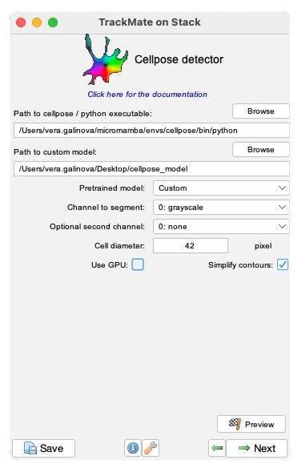
   </div>
9. Press `preview` to run prediction on one image and check the result. The cells found on the image should now be highlighted. 
   <div> 
     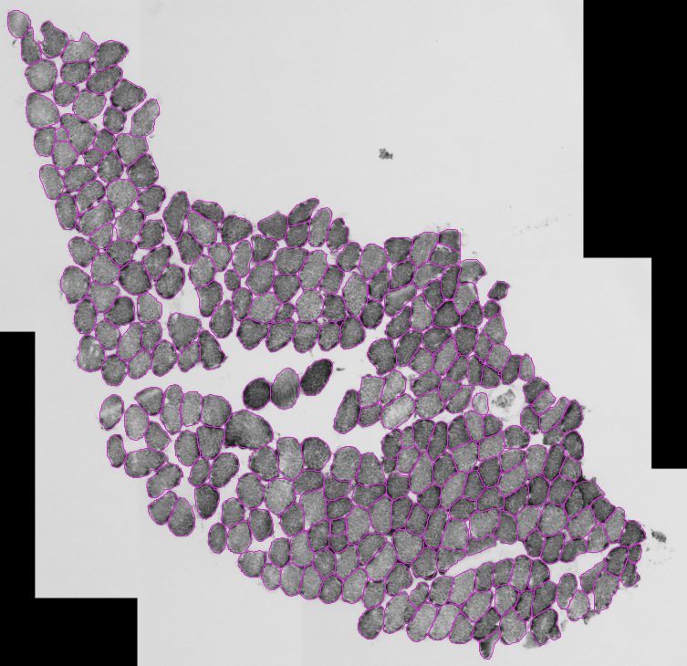
   </div>
   
10. Press Next until you see the `Select Tracker` window. Select `Manual tracking`.
   <div> 
     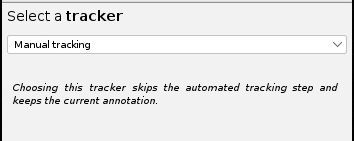
   </div>

11. Press Next until you see this window, and push the `TrackScheme` button.
   <div> 
     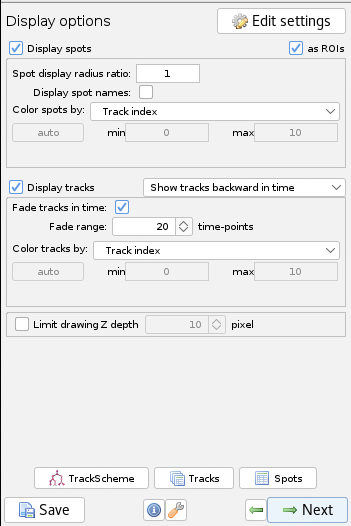
   </div>

12. Now you should select the `Spot edit` tool in the main window, on the right side. 
    <div> 
      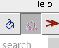
    </div>

13. Click on one of the cells, go to the next image and `Shift + Click` on the same cell on the other staining, and then Press `L`. You should see a small line appear, meaning the cells were linked.
    <div> 
      
    </div>

#### Export options
1. You can export a table with links and spot features in the `Tracks` window.  
    `Label` is the name of the cell’s ROI, and Track ID is the of the link you created.  
    You can export the resulting CSV for the downstream analysis.
    <div> 
      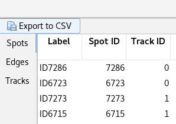
    </div>
2. You can also export the segmentation results as ROI, which will have the same IDs as in the table above. Click Next until you see “Select an action” window, choose “Export spots to IJ ROIs” and press “Execute”:
    <div> 
      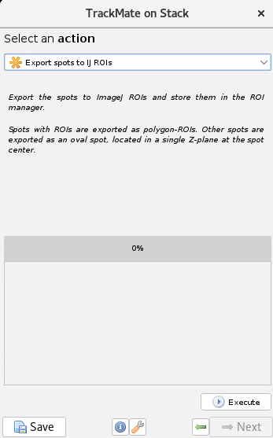
    </div>

### How to train your own Cellpose model

You can watch a video tutorial on how to use Cellpose here - [https://www.cellpose.org/](https://www.cellpose.org/) 

1. Activate the `cellpose` enviroment you installed before.
2. Run `cellpose` application.
3. Find the best working model from the `model zoo` section.
4. Look through the errors in the predictions and correct a few of them. `Click Help` > `Help with GUI` for help with labeling controls.
5. Train a new model on the corrected data. Click `Models` > `Train new model`.
6. Choose the best model from step 3 as an initial model. You cannot select a custom model as an initial model.
7. We suggest using the following settings: 
   <div> 
     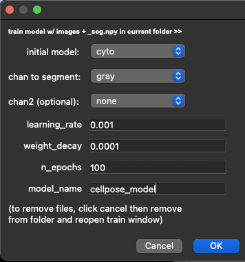
   </div>
8. After training, you’ll see your new model in the `custom models` section. It will also be saved in the folder with your data. `Cell diameter` will also be updated with what the model learned from the data.
9. You can continue iterating: predict with the model - fix a couple of mistakes - train a new model - fix mistakes - train a new model 

### Conclusion

In this tutorial, we showed how to align murine muscle images with [ImageJ BigWarp](https://imagej.net/plugins/bigwarp), segment cells with [Cellpose](https://www.cellpose.org/) and link them between multiple images using [ImageJ Trackmate](https://imagej.net/plugins/trackmate/).

[AI4Life](https://ai4life.eurobioimaging.eu)  is a Horizon Europe-funded project that brings together the computational and life science communities.

AI4Life has received funding from the European Union’s Horizon Europe research and 
innovation programme under grant agreement number 101057970. Views and opinions 
expressed are however those of the author(s) only and do not necessarily reflect those 
of the European Union or the European Research Council Executive Agency. Neither the 
European Union nor the granting authority can be held responsible for them.